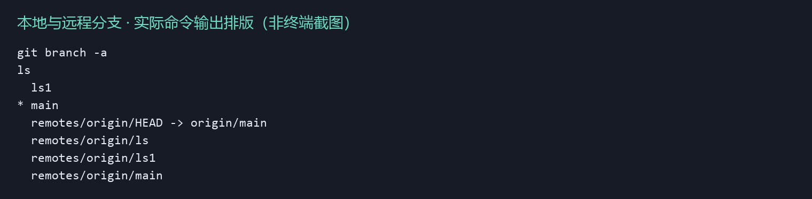
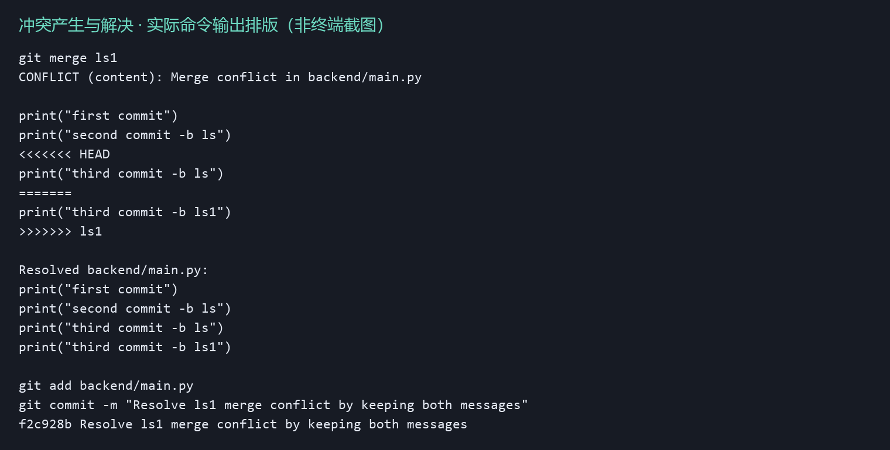
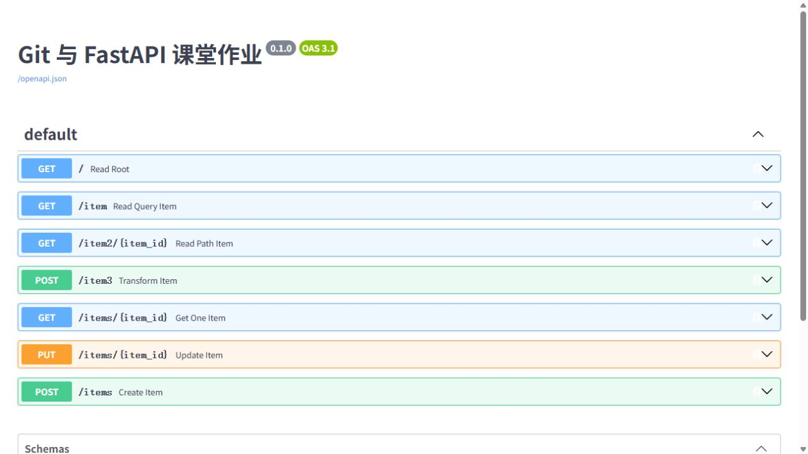
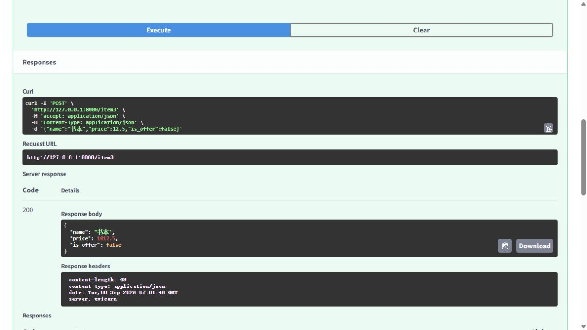

# Git 与 FastAPI 作业过程

仓库：[alililil-create/super-duper-tribble](https://github.com/alililil-create/super-duper-tribble)。

参考提供的四段视频关键画面完成本次操作。截图中的老师姓名、路径和仓库仅作为示例；本次使用自己的仓库。默认分支为 `main`，对应视频的 `master`。分支名称沿用 `ls`、`ls1`。

## 1. 代码同步与新建本地分支

克隆原仓库（起始提交 `c53b401`），创建 `backend/main.py`，提交 `print("first commit")`。运行：

```powershell
git checkout -b ls
# 添加 print("second commit -b ls") 后：
git add backend/main.py
git commit -m "second commit -b ls"
git branch -a
```

`4d110e3` 是 ls 分支的第二次打印提交；完整真实操作见 [Git 命令记录](evidence/git-transcript.txt)。

## 2. 分支同步到远程

完成分支演示后，实际执行 `git push -u origin main ls ls1`，GitHub 已接收三条分支。



[首次推送输出](evidence/push-git.txt)；[远程 ls 分支](https://github.com/alililil-create/super-duper-tribble/tree/ls)；[远程 ls1 分支](https://github.com/alililil-create/super-duper-tribble/tree/ls1)。

## 3. 合并分支并解决冲突

先合并 ls 的第二次打印提交到 main，从该位置创建 ls1。ls1 在第三行增加 `third commit -b ls1`，ls 在同一位置增加 `third commit -b ls`。先把 ls 合并到 main，再执行 `git merge ls1`，真实产生内容冲突。

```powershell
git checkout main
git merge --no-ff ls -m "Merge ls third commit"
git merge ls1
# 输出：CONFLICT (content): Merge conflict in backend/main.py
git status
git diff -- backend/main.py
```

处理方式：移除冲突标记，将双方的第三次打印各保留一行，然后 `git add backend/main.py` 并提交。解决冲突的合并提交为 `f2c928b`。



[冲突前文件](evidence/conflict-before.txt) / [解决后文件](evidence/conflict-after.py)。最终 main.py 后续改为 FastAPI 程序，四行打印的阶段结果保留在上述文件及 Git 历史中。

## 4. FastAPI GET 方法

GET 阶段提交：`380c005`。可单独查看 [get_stage.py](backend/get_stage.py)。

```python
@app.get("/")
def read_root():
    return {"Hello": "World"}

@app.get("/item")
def read_query_item(item_id: int):
    return {"item_id": item_id}

@app.get("/item2/{item_id}")
def read_path_item(item_id: int):
    return {"item_id": item_id}
```

`/item?item_id=2` 是查询参数，`/item2/2` 是路径参数，两者均返回 `{"item_id":2}`。缺少必填参数或输入非整数返回 422。



## 5. FastAPI 数据模型

数据模型阶段提交：`3db251c`。最终程序见 [backend/main.py](backend/main.py)。

```python
class Item(BaseModel):
    name: str
    price: float
    is_offer: bool = False
```

视频中 id 在演示过程中被移除；最终请求模型采用 name、price、is_offer，商品 id 在新增时生成。

实现 `POST /item3`（价格加 1000 的模型演示）、`GET /items/{item_id}`、`POST /items`、`PUT /items/{item_id}`。如视频一样，商品数据保存在内存列表，重启会恢复初始值。本次将不存在的商品改为返回 HTTP 404，并使用不同函数名区分路由。

在 Swagger 页面点击 POST /item3 → Try it out，输入 `{"name":"书本","price":12.5,"is_offer":false}`，点击 Execute，实际得到 HTTP 200 和价格 1012.5：



## 6. 验证结果

`verify_api.py` 启动独立的 Uvicorn 服务（127.0.0.1:8765），发送真实 HTTP 请求，验证后停止测试服务。共 14 项通过，另验证 OpenAPI 模型必填字段与 /docs 可访问。

| 方法 | 路径 | 实际状态码 | 结果 |
|---|---|---:|---|
| GET | `/` | 200 | 通过 |
| GET | `/item?item_id=2` | 200 | 通过 |
| GET | `/item2/2` | 200 | 通过 |
| GET | `/item` | 422 | 通过 |
| GET | `/item2/abc` | 422 | 通过 |
| POST | `/item3` | 200 | 通过 |
| POST | `/item3` | 422 | 通过 |
| POST | `/items` | 422 | 通过 |
| POST | `/items` | 200 | 通过 |
| GET | `/items/3` | 200 | 通过 |
| PUT | `/items/3` | 200 | 通过 |
| GET | `/items/3` | 200 | 通过 |
| GET | `/items/999` | 404 | 通过 |
| PUT | `/items/999` | 404 | 通过 |

[完整请求响应 JSON](evidence/api-results.json) / [服务日志](evidence/server.log) / [OpenAPI 定义](evidence/openapi.json)。

## 7. 本机重新展示

本次环境的 PowerShell 启动命令（进入项目目录后）：

```powershell
cd "D:\新建文件夹\homework"
& "..\.venv\Scripts\python.exe" backend/main.py
```

打开 <http://127.0.0.1:8000/docs>，展开接口并使用 Try it out → Execute。若现有 8000 服务仍在运行，直接打开页面。

在其他电脑首次运行：

```powershell
python -m venv .venv
.\.venv\Scripts\python.exe -m pip install -r requirements.txt
.\.venv\Scripts\python.exe backend/main.py
# 验证时另开终端：
.\.venv\Scripts\python.exe verify_api.py
```

## 8. 对照老师的表格

| 老师表格列 | 本次证据 |
|---|---|
| 代码同步到远程 | push-git.txt 与 GitHub 提交历史 |
| 新建本地分支 | git-steps.json / git-branches.png |
| 分支同步 | GitHub 分支页面 / git-branches.png |
| 合并分支、解决冲突 | git-conflict.png 与 f2c928b 合并提交 |
| FastAPI 代码提交 | 380c005 / 3db251c 与 swagger.png |
| FastAPI 数据模型 | model-response.png / api-results.json |

evidence 中的 swagger.png、model-response.png 为本次运行的浏览器截图；git-branches.png、git-conflict.png 为实际命令输出排版图，已在图中标明，并非终端截图。视频原图不作为本次完成证据。
